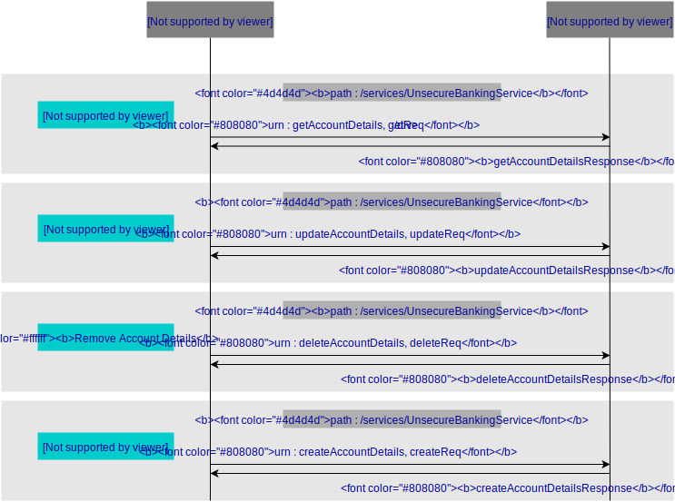

# SOAP Service
Web services are of two kinds: Simple Object Access Protocol (SOAP) and Representational State Transfer (REST). 
SOAP defines a standard communication protocol (set of rules) specification for XML-based message exchange. 
Its purpose is to induce extensibility, neutrality and independence. It uses XML Information Set for its message format, and relies on application layer protocols, most often Hypertext Transfer Protocol (HTTP) or Simple Mail Transfer Protocol (SMTP), for message negotiation and transmission.

> In this guide you will learn about deploying a custom SOAP Web service in the back-end and consuming that service using Ballerina SOAP Connectors.

The following are the sections available in this guide.

- [What you'll build](#what-youll-build)
- [Prerequisites](#prerequisites)
- [Implementation](#implementation)
- [Testing](#testing)
- [Deployment](#deployment)

## What you’ll build 
To understand how to use Ballerina language's features to write a SOAP connector which communicates with a unsecure SOAP web service running in the back-end, Let's consider a real world use case of a banking service running online where users can view, update, delete and create accounts. You can model this banking service as a SOAP Web service which is not secure; 'unsecure_banking_service', which is deployed as an Axis2 services in the back-end and accepts different SOAP requests for banking tasks such as account creation, retrieval, updating and deletion.In order to communicate with this SOAP service we are going to exploit the power of the Ballerina SOAP connector.The following diagram illustrates all the required functionality of the Ballerina SOAP connector you are going to build and the Unsecure Banking Service you are going to deploy.



- **Retrieve Account Details** : To fetch the account details, sends a SOAP request with the account number calling the getAccountDetails SOAP action.
- **Update Account Details** : To update the account balance, sends a SOAP request with account number and the updated account balance calling the updateAccountDetails SOAP action.
- **Remove Account Details** : To delete an account, sends a SOAP request with account number to be deleted calling the deleteAccountDetails SOAP action.
- **Create Account Details** : To create a new account, sends a SOAP request with account number, account holder name and account balance to be created calling the createAccountDetails SOAP action.

## Prerequisites
 
- [Ballerina Distribution](https://ballerina.io/learn/getting-started/)
- A Text Editor or an IDE 

### Optional requirements
- Ballerina IDE plugins ([IntelliJ IDEA](https://plugins.jetbrains.com/plugin/9520-ballerina), [VSCode](https://marketplace.visualstudio.com/items?itemName=WSO2.Ballerina), [Atom](https://atom.io/packages/language-ballerina))
- [Docker](https://docs.docker.com/engine/installation/)
- [Kubernetes](https://kubernetes.io/docs/setup/)

## Implementation

> If you want to skip the basics, you can download the git repo and directly move to the "Testing" section by skipping  "Implementation" section.

Let's use the following package structure for this project.

```
invoking-soap-service
 └── guide
      └── invoking_soap_service
           ├── banking_connector.bal
           ├── secure_banking_connector.bal
           ├── unsecure_banking_connector.bal
  	   └── tests
	        └── invoking_soap_service_test.bal
```

- Create the above directories in your local machine, along with the empty `.bal` files.

- Then open the terminal, navigate to consuming-a-soap-service/guide, and run the Ballerina project initializing toolkit.
```bash
   $ ballerina init
```

### Deploying the back-end SOAP web service
- [Setup the WSO2 Axis2 Server with the new UnsecureBankingService sample](https://docs.wso2.com/display/EI620/Setting+Up+the+ESB+Samples#SettingUptheESBSamples-Deployingsampleback-endservices).
- Download the [UnsecureBankingService](UnsecureBankingService.zip) source code and extract it to **<EI_HOME>/samples/axis2Server/src/** folder
- Navigate to **UnsecureBankingService** folder and execute the ant build - **ant**
- [Run the axis2 server](https://docs.wso2.com/display/EI620/Setting+Up+the+ESB+Samples#SettingUptheESBSamples-StartingtheAxis2server)

### Developing the Ballerina SOAP Consumer Client

- You can start by importing the wso2/soap library and defining the SOAP end point for the `UnsecureBankingService` and send/receive soap requests. The `unsecure_banking_connector` client comprises the resources for connecting to the back-end UnsecureBankingService.

You can add the following code segment to your `unsecure_banking_connector.bal` file. It contains a skeleton based on which you can build the unsecure banking service connector.

##### Skeleton code for unsecure_banking_connector.bal

```ballerina
import wso2/soap;
import ballerina/io;

endpoint soap:Client soapClient {
    clientConfig: {
        url: "http://localhost:9000"
    }
};

public function unsecureBankingConnector(string soapAction, xml soapBody) returns soap:SoapResponse|soap:SoapError {
    soap:SoapRequest soapRequest = {
        soapAction: soapAction,
        payload: soapBody
    };

    var soapResp = soapClient->sendReceive("/services/UnsecureBankingService", soapRequest);
    return soapResp;
}
```
- You can implement the business logic of constructing the SOAP request and calling the unsecure_banking_connector with that SOAP request in the `banking_connector.bal` file.

##### Skeleton code for banking_connector.bal

```ballerina
import ballerina/io;
import wso2/soap;

//This client is used to connect with secure and unsecure soap backends and exchange data
function main(string... args) {
    xml payload = xml `<m0:getAccountDetails xmlns:m0="http://services.samples">
                            <m0:request>
                                <m0:accountNo>2417254</m0:accountNo>
                            </m0:request>
                        </m0:getAccountDetails>`;
    var unsecureSoapResp = unsecureBankingConnector("urn:getAccountDetails", payload);
    match unsecureSoapResp {
        soap:SoapResponse soapResponse => io:println(soapResponse.payload);
        soap:SoapError soapError => io:println(soapError);
    }

//    var secureSoapResp = secureBankingConnector();
//    match secureSoapResp {
//       soap:SoapResponse soapResponse => io:println(soapResponse);
//       soap:SoapError soapError => io:println(soapError);
//    }
}
```
- With that you have completed the development of the SOAP Client to Consume the UnsecureBanking SOAP Service.

## Testing 

### Consuming the SOAP service 

You can run the SOAP service that you deployed and the Ballerina SOAP Client you have developed above, in your local environment. Open your terminal and navigate to `consuming-a-soap-service/guide`, and execute the following command.
```
$ ballerina run invoking_soap_service
```

To test the functionality of the UnsecureBanking service, send SOAP requests to fetch the account details of a specific account.

### Writing unit tests

In Ballerina, the unit test cases should be in the same package inside a folder named as 'tests'. When writing the test functions, follow the convention given below.
- Test functions should be annotated with `@test:Config`. See the following example.
```ballerina
@test:Config
function getAccountDetails() {
```

The source code for this guide contains unit test cases for each SOAP action available in the 'UnsecureBanking' service deployed above.

To run the unit tests, open your terminal and navigate to `invoking-soap-service/guide`, and run the following command.
```bash
   $ ballerina test
```

> The source code for the tests can be found at [invoking_soap_service_test.bal](https://github.com/Seralahthan/ballerina-by-guide/blob/master/consuming-a-soap-service/guide/consuming_a_soap_service/tests/consuming_a_soap_service_test.bal).

## Deployment

Once you are done with the development, you can deploy the service locally as below.

### Deploying locally

- As the first step, you can build a Ballerina executable archive (.balx) of the client that you developed. Navigate to `consuming-a-soap-service/guide` and run the following command.
```bash
   $ ballerina build invoking_soap_service
```

- Once the consuming_a_soap_service.balx is created inside the target folder, you can run that with the following command. 
```bash
   $ ballerina run target/invoking_soap_service.balx
```

- Successful running of the SOAP client results in the following output with the SOAP response for the account details.
```
<ns:getAccountDetailsResponse xmlns:ns="http://services.samples">
  <ns:return xmlns:ax25="http://services.samples/xsd" xmlns:xsi="http://www.w3.org/2001/XMLSchema-instance"   xsi:type="ax25:AccountDetails">
    <ax25:accountBalance>250000.0</ax25:accountBalance>
    <ax25:accountHolderName>Alice</ax25:accountHolderName>
    <ax25:accountNo>2417254</ax25:accountNo>
    <ax25:message xsi:nil="true"></ax25:message>
  </ns:return>
</ns:getAccountDetailsResponse>
```

